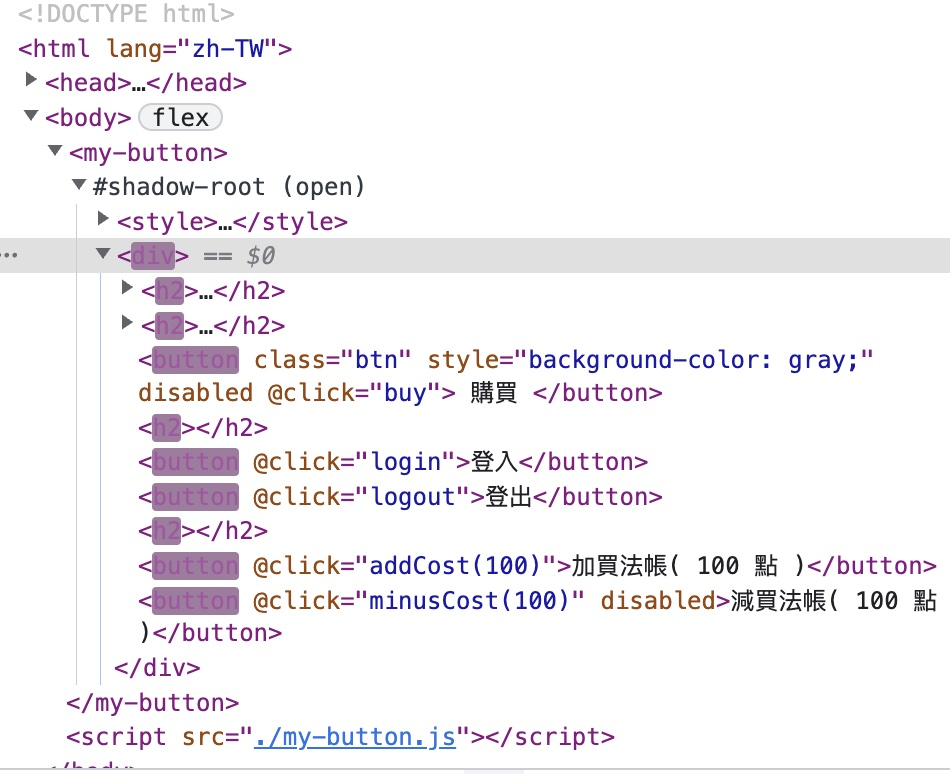
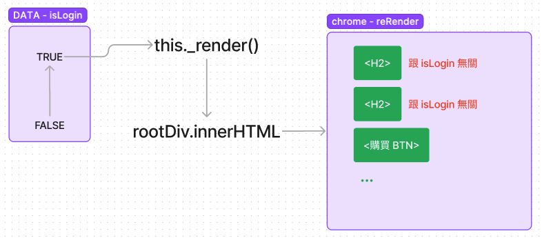
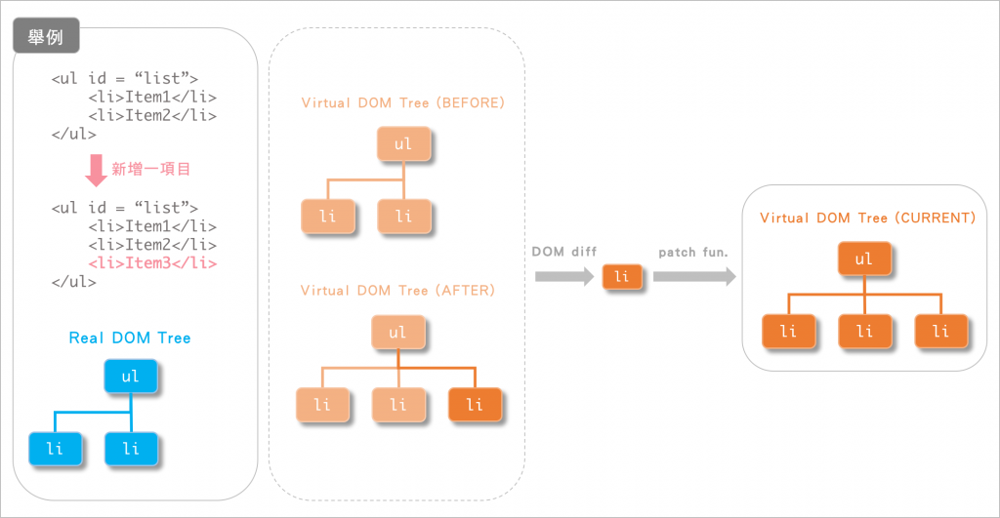
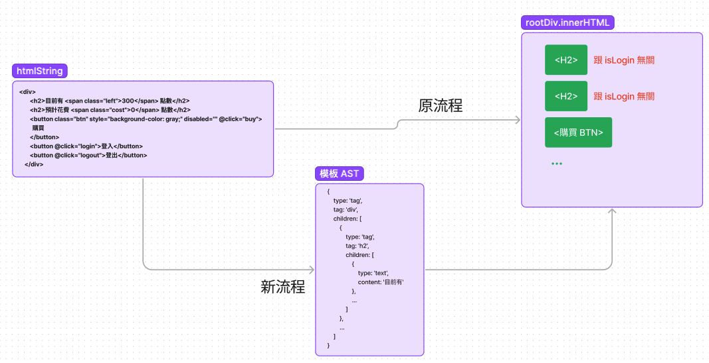

# [Day20] - Vue 的 Html 字串處理 ( Html String to Ast Object )

day-13 介紹 , 當資料改變時 , 我們可以利用 _render 來更新 dom

每次更新 isLogin 的資料時 , 就會用 innerHTML 更新 dom

目前 isLogin 資料只有跟 `<購買 BTN>` 是有相關的 , 但是我們資料變更時 , 都用 innerHTML 更新全部的 dom

因此我們在 devtool 中觀察時會發現與 isLogin 資料沒相關的 h2 也被重新 render 了！



也就是說 , isLogin 資料改變時 , 會發生下圖的內容



如果 html 的結構再大一些 , 每次都需要重新 render 全部的 dom , 這種方式肯定會讓變更又慢又久

有沒有什麼方式 , 可以讓我們只重新 render 資料變動的部分呢 ?

這時就可以引入 Virtual DOM 的概念 , 追蹤變化的部分 , 只重新 render 變化的部分



也就是說 , 在 htmlString -> innerHTML 中間有一個東東 , 然後可以比較 BEFORE 跟 AFTER 的資料差異 , 再根據差異的做變更

這個東東就是 模板 AST

```js
const oldAst = {
  type: "tag",
  tag: "ul",
  attrs: {
    id: "list"
  },
  children: [
    {
      type: "tag",
      tag: "li",
      children: [
        {
          type: "text",
          text: "Item_1"
        }
      ]
    },
    {
      type: "tag",
      tag: "li",
      children: [
        {
          type: "text",
          text: "Item_2"
        }
      ]
    }
  ]
}
```

不過要如何實作呢？


你可以發現 模板ＡＳＴ 跟你的 ＨＴＭＬ元素 是一一對應的
因此你可以了解新的流程會是如下所示


也就是說新的流程會如下所示 



接下來幾天 , 我們會介紹

1.如何將 HtmlString 轉換成模板 AST ( only tag )
2.如何將模板 AST 轉換成模板資料 ( plus attr )
skip : some wired part solving (請看書籍)
3.建立 h function
4.比對 diff
5.patch update dom


> 20 日 , 就處理到了 Vue 的 Html 字串處理 ( Html String to 模板 AST )
> 21 日 , 建立函式 createElement 將模板轉成 dom

「在 diff 函式的後方」  
也許有人會不服氣 , 不論是 innerHTML 或是 模板AST 都需要做 diff 的比對 , 只是一個是在 JS 的區塊 , 一個是在 DOM 的區塊
下面我們來做一個實驗

可是 Virtual DOM 要如何實作呢 ? 在 htmlString -> innerHTML 中間插一個 `模板 AST`

之後我們就只需要比對出 `OLD 模板 AST` 和 `NEW 模板 AST` 相異的部分 , 來進行 render
( 雖然都是全文 compare , 但是 JS 的 compare 比 innerHTML 較快 )

-----
html template -> { type : 'tag' , tagName:'span' , children : [ ... ] } -> h(xxx) -> dom

-----

可是如果每次資料改變時 , 都需要 rootDiv.innerHTML 來重新設定整個 dom ,

當 Vue component 很多層時 , 資料一有變化 , innerHTML 就會跑很久 , 才更新

因此我們需要有 Virtual Dom ( Ast Object ) 監控更改前與更改後資料的變化 , 來更新 dom ,

data 更新 -> innerHTML 更新 -> dom 更新

更改後 -> data 更新 -> 比對 ast dom tree -> dom 更新

要建立模板 ast 所以需要將 htmlString 轉成 ast object

## Html Element 的類型

> Html Element 目前有 6 種類型

- void elements : 沒有 end tag 的元素 ( ex : `<input>` . `<br>` ... )
- template element : `<template>` 用於放一些 HTML template , 不顯示在畫面中
- raw text elements : 在 HTML 檔案中 , 處理 JS . CSS 部分的元素 ( `<script>` . `<style>` )
- escapable raw text elements : textarea, title
- foreign elements : `MathML namespace` and `the SVG namespace`
- normal elements : 上述以外的 element

## 開發前分析

當我們拿到一個 html string 想要將其轉換成 AST Object 時 ,

其實對於 parser 來說 , html 上的 element 主要分為 3 大類型

- 存文字
- void tag 元素 , 且必定沒有子元素 ( void element )
- 一般 tag 元素 ( 其他元素都可以併成這一類型 )

## 使用套件 [html-parse-stringify](https://github.com/HenrikJoreteg/html-parse-stringify)

此套件很小 , 只由 parser . parseTag 跟 voidElements 三塊所組成

- voidElements - 表列所有的 voidElements 的 tag 名稱
- parseTag - 將 tag 名稱取出做比對 , 決定 tag 的類型 < 文字 . vold . 一般 >
- parser - 解析的進入點

輸出的 AST object :

```
{
    // can be `tag`, `text` or `component`
    type: 'tag',

    // name of tag if relevant
    name: 'div',
    
    // parsed attribute object
    attrs: {
        class: 'oh'
    },

    voidElement: false,

    children: [
        {
            type: 'tag',
            name: 'p',
            attrs: {},
            voidElement: false,
            children: [
              
                {
                    type: 'text',
                    content: 'hi'
                }
            ]
        }
    ]
}
```

## 分析套件的內容

我們在下方解說 套件 [html-parse-stringify](https://github.com/HenrikJoreteg/html-parse-stringify)

```
步驟提示 :
1. 抓取所有的 tag 元素
2. 遍歷其一項的 tag 並取得其名稱(name).屬性(attrs).子層(children)<子層只要取一層>
3. 利用 level . arr 形成最終的 result 
```

> STEP 1: 利用 tagRE 將所有的 <tag> 跟 </tag> 元素都找出來

```javascript
function parse(html) {

  const tagRE = /<[a-zA-Z\-\!\/](?:"[^"]*"['"]*|'[^']*'['"]*|[^'">])*>/g

  const result = html.match(tagRE);

  return result
}

// 測試 html - 
const tt = `
  <div class="container">
    <word-count limit="100">
      <h3>個人自介</h3>
      <textarea class="needcount" rows="10" placeholder="請輸入您的個人描述...">
      </textarea>
    </word-count>
  </div>
  <div class="footer"></div>
`

const arr = parse(tt)
console.log('matchArr=', arr)
/**
 * matchArr= [
 *   1.  <div class="container">
 *   2.  <word-count limit="100">
 *   3.  <h3>
 *   4.  </h3>
 *   5.  <textarea class="needcount" ...>
 *   6.  </textarea>
 *   7.  </word-count>
 *   8.  </div>
 *   9.  <div class="footer">
 *   10. </div>
 * ]
 */
```

> STEP 2: 利用 DFS (深度優先搜尋) 的固定步驟來走過所有 tag 節點

---> 需要舉一些例子 , 跟放一些圖片

I.遇到 <xxx 往內走一層 ,    
II.遇到尾巴 /xxx> . --> . void elements , 必定不會有 child 不往內走   
III.遇到尾巴 /xxx> 向外走一層   
IV.這樣就可以走完全部的的 TAG 了！

```javascript
const parseHTML = (html) => {

  // regex show the array
  const tagRE = /<[a-zA-Z\-\!\/](?:"[^"]*"['"]*|'[^']*'['"]*|[^'">])*>/g

  const result = html.match(tagRE);

  const isEndTag = tag => tag.startsWith('</');

  // root element must be template tag 
  let parent, current, level;
  let levelArr = [];

  for (let i = 0; i < result.length; i++) {

    // check it is end tag or not 
    if (!isEndTag(tag)) {

      parent = current // 將前 current 
      current = tag

      // 需要加一層
      levelArr[level + 1] = tag
    }

    // is endTag
    else {

      current = parent; // 新 current 是目前 parent
      parent = levelArr[level - 1]; // levelArr 中上面那個
      level--;
    }
  }
}
```

> STEP 3: 遍歷取到的 tag 並取得其名稱(name).屬性(attrs).子層(children)

```javascript
var parseTag = function (tag) {
  const res = {
    type: 'tag',
    name: '',
    voidElement: false,
    attrs: {},
    children: [],
  }

  const tagMatch = tag.match(/<\/?([^\s]+?)[/\s>]/)
  if (tagMatch) {
    res.name = tagMatch[1]
    if (
      voidElements[tagMatch[1]] ||
      tag.charAt(tag.length - 2) === '/'
    ) {
      res.voidElement = true
    }

    // handle comment tag
    if (res.name.startsWith('!--')) {
      const endIndex = tag.indexOf('-->')
      return {
        type: 'comment',
        comment: endIndex !== -1 ? tag.slice(4, endIndex) : '',
      }
    }
  }

  const attrRE = /\s([^'"/\s><]+?)[\s/>]|([^\s=]+)=\s?(".*?"|'.*?')/g
  const reg = new RegExp(attrRE)
  let result = null
  for (; ;) {
    result = reg.exec(tag)

    if (result === null) {
      break
    }

    if (!result[0].trim()) {
      continue
    }

    if (result[1]) {
      const attr = result[1].trim()
      let arr = [attr, '']

      if (attr.indexOf('=') > -1) {
        arr = attr.split('=')
      }

      res.attrs[arr[0]] = arr[1]
      reg.lastIndex--
    } else if (result[2]) {
      res.attrs[result[2]] = result[3].trim().substring(1, result[3].length - 1)
    }
  }

  return res
}
```

在上方我們整理了 6 個類型的 HTML Element , 只有第一個類型的 void elements

是 tag 不會成對的 element , 其餘 element 都符合以下標準形式

```html
<[tag-name]>
[tag-body]
</[tag-name]>
```

因此我們可以借助 regex `tagRE`

```javascript
var tagRE = /<[a-zA-Z\-\!\/](?:"[^"]*"['"]*|'[^']*'['"]*|[^'">])*>/g
```

來取得 `<[tag-name]>` 跟其中的 tag-name

因此我們可以抓出字串中的所有 `<[tag-name] attrs>` 區塊


### 2. 接著我們要建立 tag 的父子關係 , 建立一個 Abstract DOM Tree

> 利用 tag 的閉合特性 , 抓出 [tag-body]

當遇到 `<[tag-name] attrs>` 時 , 我們可以分析一下 ,

- <! ~~~ > : 這是 註解的起始標籤
- </ ~~~ > : 這是 結束標籤
- <input> : 這是 void elements , 只有起始標籤 , 不會有結束標籤

因此我們可以

> 靈感發想

## 參考資料

- [Vue.js 30天隨身包系列_Day04 - Virtual DOM & V-Node](https://ithelp.ithome.com.tw/articles/10193220)
- [書籍 - Vue.js 設計與實踐](https://www.tenlong.com.tw/products/9787115583864)
- [Vue learning – Convert HTML string to AST, how to convert HTML string to ast array structure](https://developpaper.com/vue-learning-convert-html-string-to-ast-how-to-convert-html-string-to-ast-array-structure/)
- [vue学习—Convert HTML string to AST，如何将html字符串转换为ast数组结构](https://segmentfault.com/a/1190000018277868)
- [html-parse-stringify](https://github.com/HenrikJoreteg/html-parse-stringify)
- [聊一聊 Javascript 中的 AST](https://juejin.cn/post/6844903960650711054)
- [造轮子系列(三): 一个简单快速的html虚拟语法树(AST)解析器](https://segmentfault.com/a/1190000010759220)
- [bfs 演算法 - 廣度優先搜尋](https://www.youtube.com/watch?v=uYcRlR0E_3s)
- [the-super-tiny-compiler](https://github.com/jamiebuilds/the-super-tiny-compiler/blob/master/the-super-tiny-compiler.js)
- [前端大概要的知道 AST](https://www.gushiciku.cn/pl/aEfc/zh-tw)
- [AST explorer](https://astexplorer.net/)
